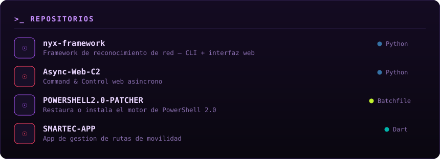

<table width="100%">
<tr>
<td width="58%" valign="top">

Ingeniero en redes y telecomunicaciones; la seguridad ofensiva la aprendí por mi cuenta y es lo que más me mueve. Entender la red desde el protocolo me cambió la forma de romperla: sé qué debería estar pasando, así que identifico rápido lo que no cuadra. Donde tengo más horas es en aplicaciones web y en dominios de Active Directory.

También construyo: disfruto automatizar y el frontend; el backend lo resuelvo cuando hace falta, aunque no sea mi terreno. Ahora sumo datos e IA al hacking, para que la máquina encuentre lo que a mí se me pasaría. Nada de esto me lo dieron resuelto — esa es la parte que me gusta.

</td>
<td width="42%" valign="top">

</td>
</tr>
</table>

Monté **UMBRA**: un reto de terminal estilo HackTheBox que corre en el navegador. No hay opciones que elegir ni puertos regalados — escribes comandos de verdad (`nmap`, `gobuster`, `curl`, `ssh`, `find`, `checksec`, `objdump`), enumeras la máquina, consigues foothold y escalas a root explotando un binario SUID vulnerable a buffer overflow: fuzzeas, sacas el offset con un patrón cíclico, encuentras la dirección de retorno y saltas. Dificultad media. Nada de esto toca sistemas reales.

  

 

