Ingeniero en redes y telecomunicaciones. Atacarlas no me lo enseñó nadie: lo aprendí por mi cuenta y terminó siendo la parte que más me mueve. Entender una red desde el protocolo me cambió la forma de romperla — sé qué debería estar pasando, así que identifico rápido lo que no cuadra.

Toco varias áreas de la ofensiva, pero donde tengo horas reales es en aplicaciones web y en dominios de Active Directory. Cuando el objetivo deja de ser una máquina y pasa a ser una organización entera, el trabajo cambia: ya no buscas una puerta, lees un mapa de confianzas y decides cuál te lleva más lejos.

Del otro lado también construyo. Lo que más disfruto es automatizar: si algo ya lo hice dos veces a mano, la tercera es un script. Y el frontend, porque me importa cómo se siente usar lo que entrego; el backend lo resuelvo cuando hace falta, aunque no sea mi terreno favorito. Últimamente estoy sumando datos e IA a la ecuación, para que la máquina correlacione lo que a mí se me pasaría a las tres de la mañana.

Nada de esto me lo dieron resuelto. Esa es justo la parte que me gusta.

 

  

 

  
  

 

  

Monté **UMBRA**: un reto de terminal estilo HackTheBox que corre en el navegador. No hay opciones que elegir ni puertos regalados — escribes comandos de verdad (`nmap`, `gobuster`, `curl`, `ssh`, `sudo -l`), enumeras la máquina, consigues foothold y escalas a root. Dificultad media. Nada de esto toca sistemas reales.

  

 

