 

<svg width="100%" height="44" viewBox="0 0 860 44" xmlns="http://www.w3.org/2000/svg" role="img" aria-label="whoami">
<defs>
<linearGradient id="tb1bg" x1="0" y1="0" x2="0" y2="1"><stop offset="0%" stop-color="#1c1626"/><stop offset="100%" stop-color="#100a1a"/></linearGradient>
<linearGradient id="tb1line" x1="0" y1="0" x2="1" y2="0"><stop offset="0%" stop-color="#f43f5e"/><stop offset="100%" stop-color="#a855f7"/></linearGradient>
<clipPath id="tb1clip"><rect x="336" y="0" width="0" height="44"><animate attributeName="width" from="0" to="189" dur="1.3s" fill="freeze"/></rect></clipPath>
</defs>
<rect x="0" y="0" width="860" height="44" rx="10" fill="url(#tb1bg)" stroke="#2a1c46" stroke-width="1.5"/>
<rect x="6" y="41" width="848" height="2" fill="url(#tb1line)"/>
<text x="16" y="27" font-family="ui-monospace, 'Cascadia Mono', 'SF Mono', Menlo, Consolas, monospace" font-size="13" fill="#c891ff">&gt;_</text>
<text x="790" y="27" font-family="ui-monospace, monospace" font-size="13" fill="#6a4a8f">—</text>
<text x="812" y="27" font-family="ui-monospace, monospace" font-size="12" fill="#6a4a8f">▢</text>
<text x="834" y="27" font-family="ui-monospace, monospace" font-size="13" fill="#f43f5e">✕</text>
<g clip-path="url(#tb1clip)" font-family="ui-monospace, 'Cascadia Mono', 'SF Mono', Menlo, Consolas, monospace" font-size="15">
<text x="336" y="28" fill="#c891ff">diego@umbra<tspan fill="#6a4a8f">:~$ </tspan><tspan fill="#f43f5e">whoami</tspan></text>
</g>
<rect x="528" y="12" width="8" height="18" fill="#f43f5e" opacity="0">
<animate attributeName="opacity" values="0;1;1;0" dur="1s" begin="1.3s" repeatCount="indefinite"/>
</rect>
</svg>

Ingeniero de TI y operaciones de seguridad. Paso el día entre levantar sistemas y buscarles la vuelta para tumbarlos, y la verdad las dos mitades se alimentan: rompo mejor porque sé cómo se arma algo, y armo con más cuidado porque ya vi por dónde se cae.

Lo que de verdad me atrapa es automatizar. Un problema que resuelvo dos veces a mano ya me está pidiendo un script a gritos; por eso casi todo lo que escribo termina convertido en una herramienta que me quita el trabajo repetido de encima.

En la parte ofensiva me muevo sobre la web y sobre Linux — es donde tengo más horas encima y donde vive casi todo lo que he comprometido. Cuando el objetivo deja de ser una sola máquina y se vuelve una organización completa, entra Active Directory y el tablero cambia por completo: ya no atacas una caja, lees un mapa de confianzas.

Y hacia donde estoy jalando ahora: datos e IA puestos al servicio del hacking. Nada de tableros de negocio — modelos que buscan, correlacionan y encuentran lo que a un humano se le pasa.

 

  

<svg width="100%" height="4" viewBox="0 0 900 4" xmlns="http://www.w3.org/2000/svg">
<defs><linearGradient id="rr1" x1="0" y1="0" x2="1" y2="0"><stop offset="0%" stop-color="#0a0710"/><stop offset="50%" stop-color="#a855f7"/><stop offset="100%" stop-color="#0a0710"/></linearGradient></defs>
<rect width="900" height="2" y="1" fill="url(#rr1)"/>
<rect width="140" height="4" fill="#f43f5e"><animate attributeName="x" values="-140;900" dur="3.5s" repeatCount="indefinite"/></rect>
</svg>

<svg width="100%" height="44" viewBox="0 0 860 44" xmlns="http://www.w3.org/2000/svg" role="img" aria-label="Herramientas de cabecera">
<defs>
<linearGradient id="tb2bg" x1="0" y1="0" x2="0" y2="1"><stop offset="0%" stop-color="#1c1626"/><stop offset="100%" stop-color="#100a1a"/></linearGradient>
<linearGradient id="tb2line" x1="0" y1="0" x2="1" y2="0"><stop offset="0%" stop-color="#a855f7"/><stop offset="100%" stop-color="#f43f5e"/></linearGradient>
<clipPath id="tb2clip"><rect x="304" y="0" width="0" height="44"><animate attributeName="width" from="0" to="252" dur="1.7s" fill="freeze"/></rect></clipPath>
</defs>
<rect x="0" y="0" width="860" height="44" rx="10" fill="url(#tb2bg)" stroke="#2a1c46" stroke-width="1.5"/>
<rect x="6" y="41" width="848" height="2" fill="url(#tb2line)"/>
<text x="16" y="27" font-family="ui-monospace, 'Cascadia Mono', 'SF Mono', Menlo, Consolas, monospace" font-size="13" fill="#c891ff">&gt;_</text>
<text x="790" y="27" font-family="ui-monospace, monospace" font-size="13" fill="#6a4a8f">—</text>
<text x="812" y="27" font-family="ui-monospace, monospace" font-size="12" fill="#6a4a8f">▢</text>
<text x="834" y="27" font-family="ui-monospace, monospace" font-size="13" fill="#f43f5e">✕</text>
<g clip-path="url(#tb2clip)" font-family="ui-monospace, 'Cascadia Mono', 'SF Mono', Menlo, Consolas, monospace" font-size="15">
<text x="304" y="28" fill="#c891ff">diego@umbra<tspan fill="#6a4a8f">:~$ </tspan><tspan fill="#f43f5e">ls -la tools/</tspan></text>
</g>
<rect x="559" y="12" width="8" height="18" fill="#f43f5e" opacity="0">
<animate attributeName="opacity" values="0;1;1;0" dur="1s" begin="1.7s" repeatCount="indefinite"/>
</rect>
</svg>

  

 

<svg width="100%" height="4" viewBox="0 0 900 4" xmlns="http://www.w3.org/2000/svg">
<defs><linearGradient id="rr2" x1="0" y1="0" x2="1" y2="0"><stop offset="0%" stop-color="#0a0710"/><stop offset="50%" stop-color="#f43f5e"/><stop offset="100%" stop-color="#0a0710"/></linearGradient></defs>
<rect width="900" height="2" y="1" fill="url(#rr2)"/>
<rect width="140" height="4" fill="#a855f7"><animate attributeName="x" values="-140;900" dur="3.5s" repeatCount="indefinite"/></rect>
</svg>

<svg width="100%" height="44" viewBox="0 0 860 44" xmlns="http://www.w3.org/2000/svg" role="img" aria-label="En números">
<defs>
<linearGradient id="tb3bg" x1="0" y1="0" x2="0" y2="1"><stop offset="0%" stop-color="#1c1626"/><stop offset="100%" stop-color="#100a1a"/></linearGradient>
<linearGradient id="tb3line" x1="0" y1="0" x2="1" y2="0"><stop offset="0%" stop-color="#f43f5e"/><stop offset="100%" stop-color="#a855f7"/></linearGradient>
<clipPath id="tb3clip"><rect x="318" y="0" width="0" height="44"><animate attributeName="width" from="0" to="225" dur="1.5s" fill="freeze"/></rect></clipPath>
</defs>
<rect x="0" y="0" width="860" height="44" rx="10" fill="url(#tb3bg)" stroke="#2a1c46" stroke-width="1.5"/>
<rect x="6" y="41" width="848" height="2" fill="url(#tb3line)"/>
<text x="16" y="27" font-family="ui-monospace, 'Cascadia Mono', 'SF Mono', Menlo, Consolas, monospace" font-size="13" fill="#c891ff">&gt;_</text>
<text x="790" y="27" font-family="ui-monospace, monospace" font-size="13" fill="#6a4a8f">—</text>
<text x="812" y="27" font-family="ui-monospace, monospace" font-size="12" fill="#6a4a8f">▢</text>
<text x="834" y="27" font-family="ui-monospace, monospace" font-size="13" fill="#f43f5e">✕</text>
<g clip-path="url(#tb3clip)" font-family="ui-monospace, 'Cascadia Mono', 'SF Mono', Menlo, Consolas, monospace" font-size="15">
<text x="318" y="28" fill="#c891ff">diego@umbra<tspan fill="#6a4a8f">:~$ </tspan><tspan fill="#f43f5e">./stats.sh</tspan></text>
</g>
<rect x="546" y="12" width="8" height="18" fill="#f43f5e" opacity="0">
<animate attributeName="opacity" values="0;1;1;0" dur="1s" begin="1.5s" repeatCount="indefinite"/>
</rect>
</svg>

 

<svg width="100%" height="4" viewBox="0 0 900 4" xmlns="http://www.w3.org/2000/svg">
<defs><linearGradient id="rr3" x1="0" y1="0" x2="1" y2="0"><stop offset="0%" stop-color="#0a0710"/><stop offset="50%" stop-color="#a855f7"/><stop offset="100%" stop-color="#0a0710"/></linearGradient></defs>
<rect width="900" height="2" y="1" fill="url(#rr3)"/>
<rect width="140" height="4" fill="#f43f5e"><animate attributeName="x" values="-140;900" dur="3.5s" repeatCount="indefinite"/></rect>
</svg>

<svg width="100%" height="44" viewBox="0 0 860 44" xmlns="http://www.w3.org/2000/svg" role="img" aria-label="Antes de irte, entra a una máquina">
<defs>
<linearGradient id="tb4bg" x1="0" y1="0" x2="0" y2="1"><stop offset="0%" stop-color="#1c1626"/><stop offset="100%" stop-color="#100a1a"/></linearGradient>
<linearGradient id="tb4line" x1="0" y1="0" x2="1" y2="0"><stop offset="0%" stop-color="#a855f7"/><stop offset="100%" stop-color="#f43f5e"/></linearGradient>
<clipPath id="tb4clip"><rect x="300" y="0" width="0" height="44"><animate attributeName="width" from="0" to="261" dur="1.75s" fill="freeze"/></rect></clipPath>
</defs>
<rect x="0" y="0" width="860" height="44" rx="10" fill="url(#tb4bg)" stroke="#2a1c46" stroke-width="1.5"/>
<rect x="6" y="41" width="848" height="2" fill="url(#tb4line)"/>
<text x="16" y="27" font-family="ui-monospace, 'Cascadia Mono', 'SF Mono', Menlo, Consolas, monospace" font-size="13" fill="#c891ff">&gt;_</text>
<text x="790" y="27" font-family="ui-monospace, monospace" font-size="13" fill="#6a4a8f">—</text>
<text x="812" y="27" font-family="ui-monospace, monospace" font-size="12" fill="#6a4a8f">▢</text>
<text x="834" y="27" font-family="ui-monospace, monospace" font-size="13" fill="#f43f5e">✕</text>
<g clip-path="url(#tb4clip)" font-family="ui-monospace, 'Cascadia Mono', 'SF Mono', Menlo, Consolas, monospace" font-size="15">
<text x="300" y="28" fill="#c891ff">diego@umbra<tspan fill="#6a4a8f">:~$ </tspan><tspan fill="#f43f5e">ssh root@UMBRA</tspan></text>
</g>
<rect x="564" y="12" width="8" height="18" fill="#f43f5e" opacity="0">
<animate attributeName="opacity" values="0;1;1;0" dur="1s" begin="1.75s" repeatCount="indefinite"/>
</rect>
</svg>

Monté **UMBRA**: un reto de terminal estilo HackTheBox que corre en el navegador. No hay opciones que elegir ni puertos regalados — escribes comandos de verdad (`nmap`, `gobuster`, `curl`, `ssh`, `sudo -l`), enumeras la máquina, consigues foothold y escalas a root. Dificultad media. Nada de esto toca sistemas reales.

  

 

